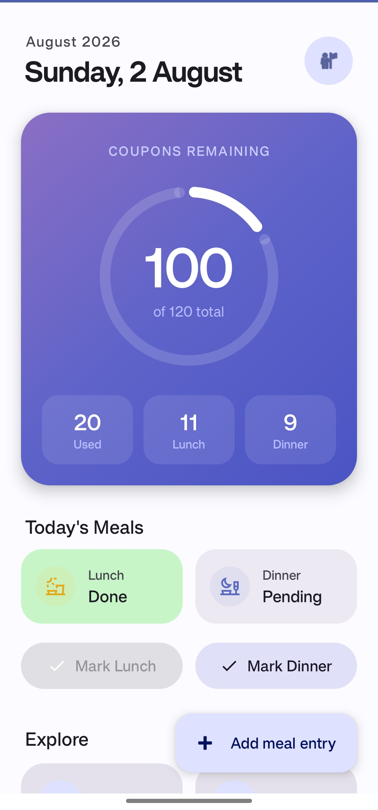
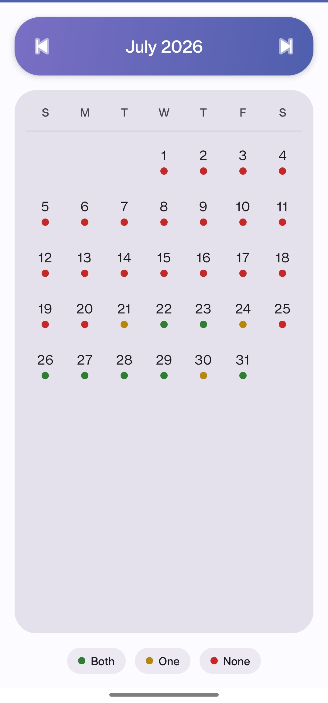
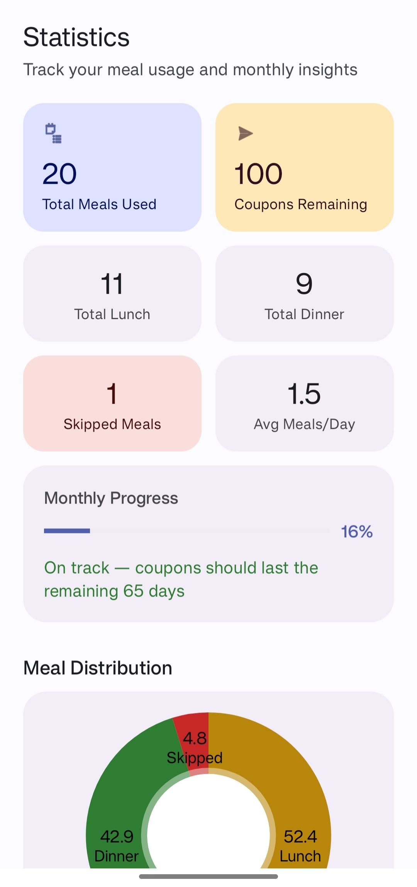
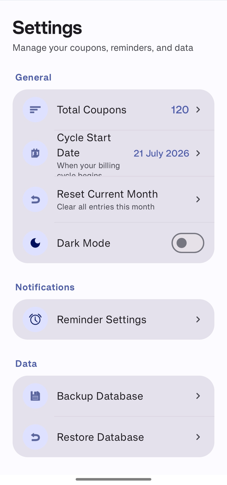

<div align="center">

# 🍱 Mess Manager

### A modern, offline-first Android app to track monthly mess & canteen meal coupons.

[](https://developer.android.com)
[](https://www.oracle.com/java/)
[](https://developer.android.com)
[](https://developer.android.com/topic/architecture)
[](#-privacy--security)

<br/>

**Mess Manager** replaces manual calendar tallying with an intuitive, automated coupon counter, daily meal logger, visual calendar, and smart usage analytics. Built as a personal utility app — 100% offline, zero ads, no account registration required.

</div>

---

## 📸 App Screenshots

<div align="center">

| 🏠 **Dashboard** | 📅 **Calendar View** | 📊 **Statistics** | ⚙️ **Settings** |
| :-: | :-: | :-: | :-: |
|  |  |  |  |

</div>

---

## ✨ Key Features

### 📊 Smart Dashboard
- **Live Circular Progress**: Real-time visualization of remaining coupons versus total monthly allowance.
- **At-a-Glance Stat Chips**: Total Meals Used, Lunch Count, and Dinner Count summary boxes.
- **Today's Status Pills**: Instant visual status (Pending / Done) for Lunch & Dinner.
- **One-Tap Quick Mark**: Convenient quick-action buttons to log meals in seconds.

### 📅 Interactive Monthly Calendar
- Color-coded daily indicators:
  - 🟢 **Both Meals**: Logged both Lunch and Dinner.
  - 🟡 **One Meal**: Logged either Lunch or Dinner.
  - 🔴 **Skipped**: No meals taken on that date.
- Tap any date to view or modify logged entries.

### 📈 Analytics & Insights
- **Meal Distribution Chart**: Half-donut chart illustrating Lunch vs. Dinner vs. Skipped proportion.
- **Smart Pace Prediction**: Dynamic algorithm estimating whether your coupon balance will last the remaining cycle days.
- **Daily Average Tracking**: Calculates average meals consumed per day.

### ⚙️ Customizable Settings
- **Custom Billing Cycle**: Set any cycle start date (e.g., 21st to 20th of next month).
- **Coupon Manager**: Adjust your monthly coupon quota anytime.
- **Meal Reminders**: Scheduled local notifications for Lunch and Dinner times.
- **Backup & Restore**: Export complete SQLite database backups or import previous backups.
- **Dark Mode**: Native Android Dark Mode support with smooth theme switching.

---

## 🛠️ Architecture & Tech Stack

```text
               ┌─────────────────────────────────────────┐
               │           UI Layer (Activities)         │
               │  Dashboard | Calendar | Stats | Settings │
               └────────────────────┬────────────────────┘
                                    │ LiveData
                                    ▼
               ┌─────────────────────────────────────────┐
               │             ViewModel Layer             │
               │  (DashboardViewModel, StatsViewModel)   │
               └────────────────────┬────────────────────┘
                                    │ Reactive Queries
                                    ▼
               ┌─────────────────────────────────────────┐
               │            Repository Layer             │
               │             (MealRepository)            │
               └────────────────────┬────────────────────┘
                                    │ DAO
                                    ▼
               ┌─────────────────────────────────────────┐
               │     Local Data Layer (Room / SQLite)    │
               └─────────────────────────────────────────┘
```

- **UI Framework**: Material Design 3 (`com.google.android.material`), ViewBinding, CoordinatorLayout, NestedScrollView
- **Local Persistence**: Room Database (`androidx.room`) & Android Preferences (`SharedPreferences`)
- **Architecture Pattern**: MVVM + Repository Pattern
- **Charting**: MPAndroidChart (`com.github.PhilJay:MPAndroidChart`)
- **Background Tasks**: AndroidX WorkManager & AlarmManager notifications

---

## 📂 Project Directory Structure

```text
com.example.messmanager/
├── data/
│   ├── backup/          # Database backup and restore utilities
│   ├── local/           # Room Database, DAO interfaces, and Entities
│   ├── preferences/     # AppPreferences (coupon limits & cycle settings)
│   └── repository/      # Central data repository layer
├── notification/        # Local notification triggers and channels
├── ui/
│   ├── addmeal/         # Add and Edit meal entry screens
│   ├── backup/          # Backup & Restore UI
│   ├── calendar/        # Monthly interactive calendar UI
│   ├── dashboard/       # Main hero dashboard and status cards
│   ├── history/         # Searchable meal history log
│   ├── reminders/       # Notification reminder settings UI
│   ├── settings/        # App configuration & preferences
│   ├── splash/          # AndroidX splash screen
│   └── statistics/      # Analytical charts & pace prediction
└── util/                # Date math, formatters, and helper classes
```

---

## 🚀 Getting Started

### Prerequisites
- Android Studio (2024.2+ recommended)
- JDK 11
- Device or Emulator running Android 7.0 (API 24) or higher

### Build Instructions

1. **Clone the repository**:
   ```bash
   git clone https://github.com/Rohu06/MessManager.git
   cd MessManager
   ```

2. **Open & Build in Android Studio**:
   - Open project in Android Studio.
   - Build via Gradle: `./gradlew assembleDebug`

---

## 🔒 Privacy & Security

- **100% Local**: All records are stored exclusively in an encrypted on-device SQLite database.
- **No Cloud Services**: Zero remote server calls, zero telemetry, and zero tracking.

---

<div align="center">

Crafted for personal meal tracking 🍱

</div>
