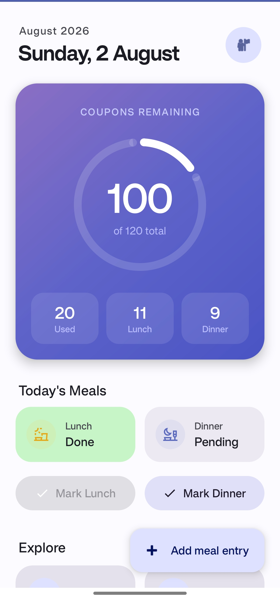
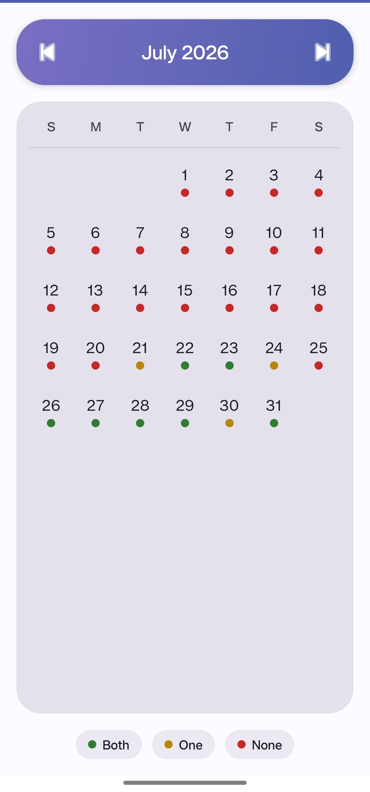
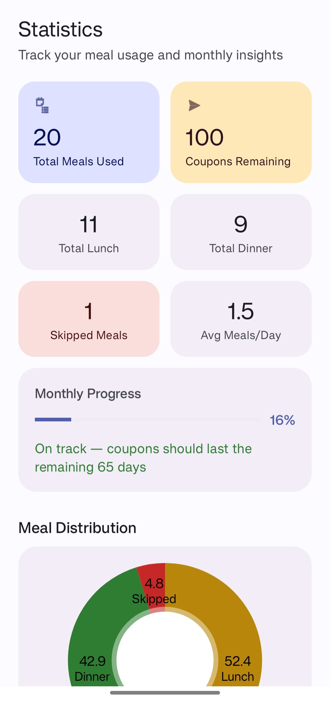
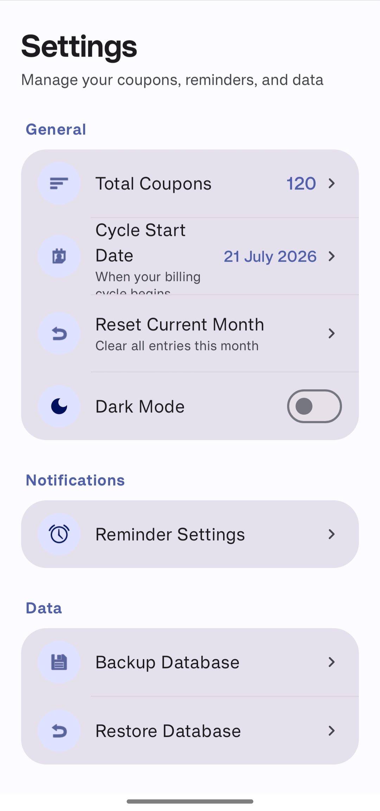

<div align="center">

# 🍱 Mess Manager

**A modern, offline-first Android app to track monthly mess & canteen meal coupons.**

<br/>

[](https://developer.android.com)
[](https://www.oracle.com/java/)
[](https://developer.android.com)
[](https://developer.android.com/topic/architecture)
[](#-privacy--security)

<br/>

> Replaces manual calendar tallying with an intuitive coupon counter, daily meal logger,
> visual calendar, and smart usage analytics.
> **100% offline · Zero ads · No account required.**

</div>

---

## 📸 Screenshots

<div align="center">

| 🏠 Dashboard | 📅 Calendar | 📊 Statistics | ⚙️ Settings |
|:---:|:---:|:---:|:---:|
|  |  |  |  |

</div>

---

## ✨ Features

<table>
<tr>
<td valign="top" width="50%">

### 📊 Smart Dashboard
- **Live Circular Progress** — Real-time coupon usage ring
- **Stat Chips** — Total / Lunch / Dinner at a glance
- **Today's Status Pills** — Pending or Done for each meal
- **One-Tap Quick Mark** — Log meals in seconds
- **Micro-Animations** — Count-up stats & tactile button feedback

</td>
<td valign="top" width="50%">

### 📅 Interactive Calendar
- **Color-coded indicators** per day:
  - 🟢 Both meals logged
  - 🟡 One meal logged
  - 🔴 No meals (skipped)
- Tap any date to view or edit entries
- Seamless shared-element transitions

</td>
</tr>
<tr>
<td valign="top" width="50%">

### 📈 Analytics & Insights
- **Meal Distribution Chart** — Half-donut Lunch vs. Dinner vs. Skipped
- **Smart Pace Prediction** — Will your coupons last the cycle?
- **Daily Average Tracking** — Meals consumed per active day

</td>
<td valign="top" width="50%">

### ⚙️ Customizable Settings
- **Custom Billing Cycle** — Set any start date (e.g., 21st → 20th)
- **Coupon Manager** — Adjust monthly quota anytime
- **Meal Reminders** — Notifications with quick-action mark from shade
- **Backup & Export** — SQLite backup, restore, and CSV export
- **Dark Mode** — Smooth native theme switching

</td>
</tr>
</table>

---

## 🛠️ Tech Stack

<div align="center">

| Layer | Technology |
|:---|:---|
| **UI** | Material Design 3 · ViewBinding · CoordinatorLayout · NestedScrollView |
| **Architecture** | MVVM + Repository Pattern |
| **Local Storage** | Room Database (SQLite) · SharedPreferences |
| **Charts** | MPAndroidChart |
| **Background Work** | WorkManager · AlarmManager |
| **Language** | Java 11 |
| **Min / Target SDK** | API 24 (Android 7.0) / API 36 |

</div>

<br/>

### Architecture Diagram

```
┌──────────────────────────────────────────┐
│          UI Layer  (Activities)          │
│  Dashboard · Calendar · Stats · Settings │
└────────────────────┬─────────────────────┘
                     │  LiveData / ViewModels
                     ▼
┌──────────────────────────────────────────┐
│           ViewModel Layer                │
│   DashboardViewModel · StatsViewModel    │
└────────────────────┬─────────────────────┘
                     │  Reactive Queries
                     ▼
┌──────────────────────────────────────────┐
│           Repository Layer               │
│              MealRepository              │
└────────────────────┬─────────────────────┘
                     │  DAO
                     ▼
┌──────────────────────────────────────────┐
│      Local Data Layer (Room / SQLite)    │
└──────────────────────────────────────────┘
```

---

## 📂 Project Structure

```
com.example.messmanager/
├── data/
│   ├── backup/          # DB backup & restore utilities
│   ├── local/           # Room DB, DAO interfaces, Entities
│   ├── preferences/     # AppPreferences (coupon limits & cycle)
│   └── repository/      # Central data repository
├── notification/        # Local notification channels & triggers
├── ui/
│   ├── addmeal/         # Add / Edit meal entry screens
│   ├── backup/          # Backup & Restore UI
│   ├── calendar/        # Monthly interactive calendar
│   ├── dashboard/       # Hero dashboard & status cards
│   ├── history/         # Searchable meal history log
│   ├── reminders/       # Reminder settings UI
│   ├── settings/        # App configuration & preferences
│   ├── splash/          # AndroidX SplashScreen
│   └── statistics/      # Charts & pace prediction
└── util/                # Date math, formatters, helpers
```

---

## 🚀 Getting Started

### Prerequisites

| Requirement | Version |
|:---|:---|
| Android Studio | 2024.2+ (recommended) |
| JDK | 11 |
| Android Device / Emulator | API 24+ (Android 7.0+) |

### Build & Run

```bash
# 1. Clone the repository
git clone https://github.com/Rohu06/MessManager.git
cd MessManager

# 2. Open in Android Studio, then build via Gradle:
./gradlew assembleDebug
```

> **Tip:** Open directly in Android Studio and let Gradle sync automatically before running on a device or emulator.

---

## 🔒 Privacy & Security

| | |
|:---:|:---|
| 🔐 | **100% Local** — All data stored exclusively on-device in an SQLite database |
| 🚫 | **No Cloud** — Zero remote server calls, zero telemetry, zero tracking |
| 👤 | **No Account** — No sign-up, no login, no personal data collected |

---

## 📄 License

This project is open for personal and educational use.

---

<div align="center">

Crafted with ❤️ for personal meal tracking 🍱

</div>
